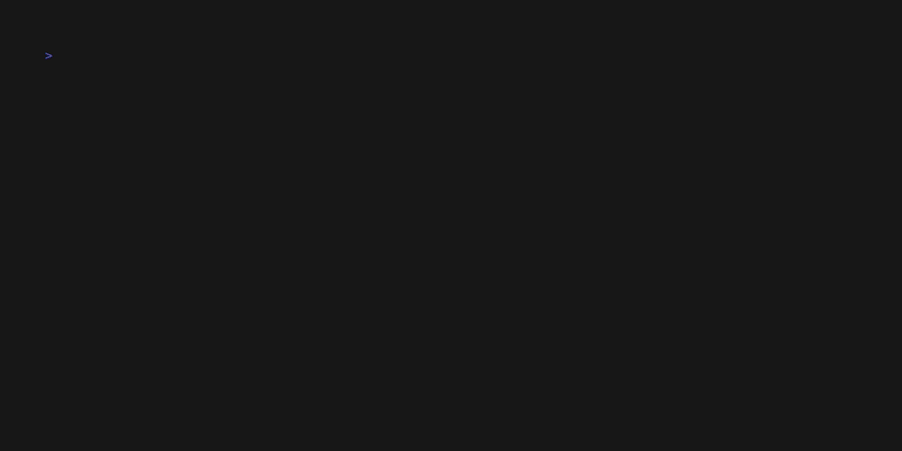
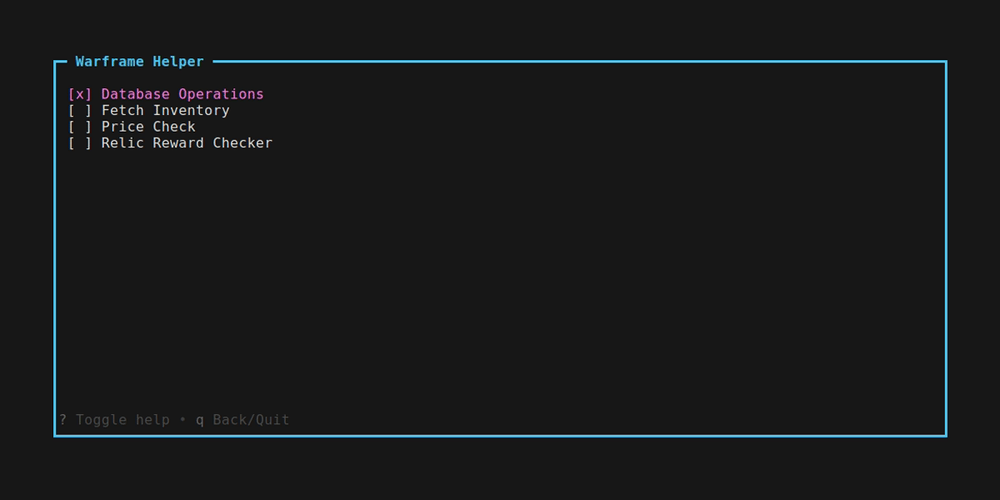
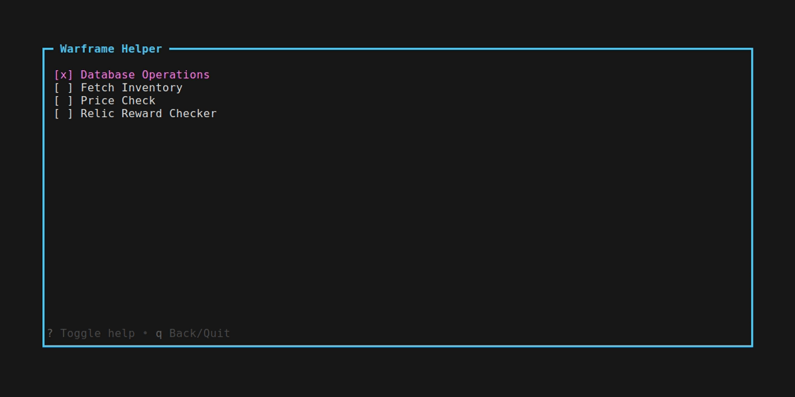
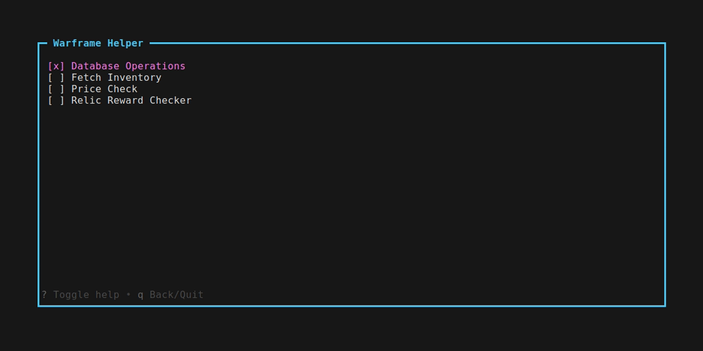
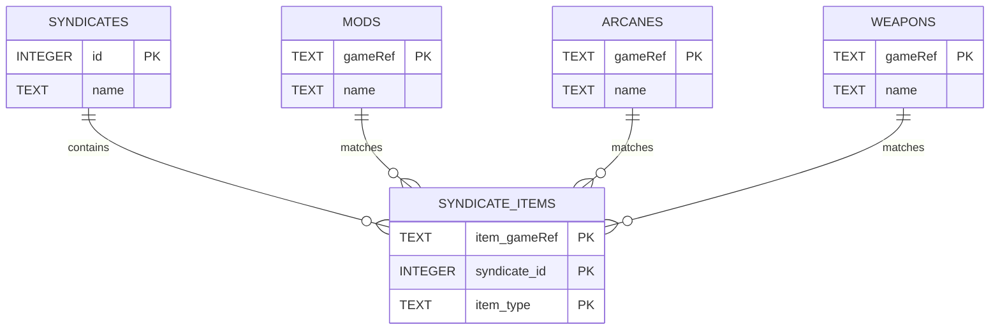
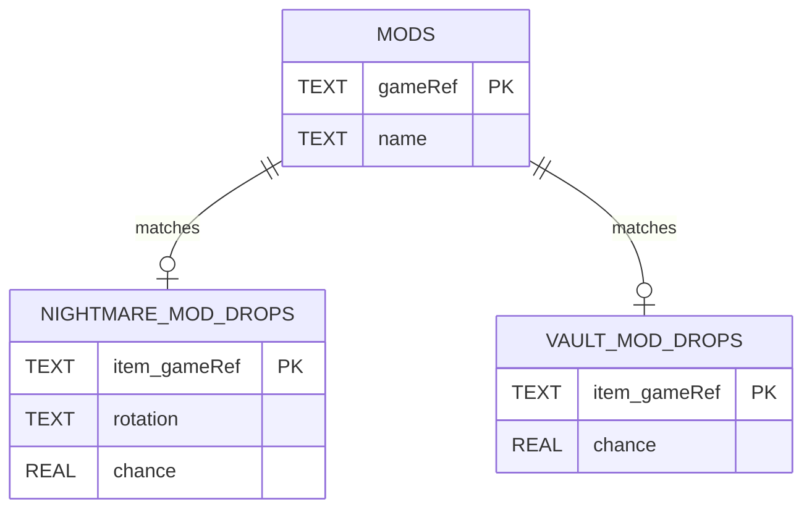

# warframe-helper

A terminal UI for Warframe utilities, including inventory fetching, database management, market price checking, and live relic reward price lookup.

Windows support has only been synthetically tested. No actual functionality has been verified on Windows.

License: MIT with Commons Clause License Condition v1.0. This is not plain MIT and is not OSI-approved open source. See [LICENSE](LICENSE) for details.

Warframe is a trademark of Digital Extremes Ltd. This project is unofficial and is not affiliated with or endorsed by Digital Extremes.

The Tesseract-based relic reward OCR and the entire application test suite were vibecoded.

This project contains derivative work based on [warframe-api-helper](https://github.com/Sainan/warframe-api-helper) and is distributed under the same license terms.

The inventory fetch functionality uses a memory scan and is blocked until you grant explicit permission in the app. That scan could lead to a possible ban. Use it at your own risk, I am not responsible for any consequences arising from it.

## Features

- **Database Operations**: downloads and keeps a local SQLite database of all tradable items (mods, arcanes, warframes, weapons, archwing, companions, misc), including syndicate associations, official nightmare/vault drop data, ducat values, and sync tracking metadata
- **Fetch Inventory**: scans game memory for the session data needed to fetch your inventory through the Warframe mobile API and save it locally
- **Price Check**: cross-references items against the [Warframe Market](https://warframe.market) API and shows average prices, trade volume, and selected drop metadata
- **Relic Reward Checker**: continuously captures the screen, detects the reward selection screen, OCRs the visible item names, and displays live market prices

## Requirements

- [Go](https://go.dev/) 1.26.2+
- Warframe running (for inventory fetch and relic reward checker)
- [Tesseract](https://github.com/tesseract-ocr/tesseract) v5+ in `PATH` (for relic reward checker)
- Linux: `grim` (wlroots/Wayland), `spectacle` (KDE Wayland, uses `spectacle -bnfa`), or `scrot` (X11). The first available tool is used
- Windows: no additional tools needed

## Install

Pre-built binaries are available on the [Releases](../../releases) page:

- Linux: download `warframe-helper-linux-amd64`, make it executable with `chmod +x`, then run it
- Windows: download `warframe-helper-windows-amd64.exe` and run it

You can also install from source with Go:

```sh
go install github.com/gjrud/warframe-helper@latest
```

This installs the binary to your Go bin directory (`$GOBIN` or `$GOPATH/bin`).

## Build & Run

This project is currently pinned to Go `1.26.2`.

```sh
go run .
# or
go build -o warframe-helper && ./warframe-helper
```

## Testing

Default automated tests mirror CI:

```sh
go test -cover ./...  # Linux CI
# and
go test ./...         # Windows CI
```

Tests that require a real desktop session, local `tesseract`, network access, or a live Warframe process are kept out of CI behind the `manual` build tag.

For memory-scanner manual tests, Warframe must be running.

Run all manual tests:

```sh
go test -tags manual ./utils/relicdetect ./utils/memoryScanner
```

Run only OCR manual tests:

```sh
go test -tags manual ./utils/relicdetect -run 'TestManual(OCRRegion|ExtractItemNames)'
```

Run only Linux screenshot manual tests:

```sh
go test -tags manual ./utils/relicdetect -run TestManualProbeCapture
```

Run only memory-scanner manual tests:

```sh
go test -tags manual ./utils/memoryScanner -run 'Manual'
```

Run only Linux maps parsing manual test:

```sh
go test -tags manual ./utils/memoryScanner -run TestReadMapsManual
```

## Usage

Navigate with `e`/`d` (or arrow keys), confirm with `Enter`, toggle help with `?`, and go back or quit with `q`/`Esc`/`Ctrl+C`.

### Database Operations

Fetches all tradable items from the [Warframe Market](https://warframe.market) `/v2/items` API and stores them in a local SQLite database at `~/.warframe-helper/warframe.db`, organised into seven category tables: mods, arcanes, warframes, weapons, archwing, companions, and misc (catch-all for items with unrecognised tags). Also populates syndicate associations for mods, arcanes, and weapons, Baro Ki'Teer ducat values for weapons, warframes, archwing, and companions using [WFCD/warframe-items](https://github.com/WFCD/warframe-items) data, and official nightmare/vault mod drops from [`https://www.warframe.com/droptables`](https://www.warframe.com/droptables). Run this before price checking.



The fetch-data view now shows database freshness before you start a sync:

- `Checking upstream status...` while the latest WFCD snapshot is being resolved
- `Database up to date: <sha>` when the stored WFCD commit matches upstream
- `Database stale: <old> -> <new>` when upstream has moved on
- `Database status unknown` when the DB exists but tracking metadata is missing or the upstream check fails
- `Database not present` when `~/.warframe-helper/warframe.db` does not exist yet
- `Last sync: ...` showing the last successful full sync time in UTC

Each successful sync stores the completed time and the WFCD commit SHA used for that run in a `sync_status` table inside `warframe.db`. At sync start, the app resolves the latest commit on WFCD `master`, then uses that exact SHA for all WFCD enrichment requests so the saved metadata matches the data actually used during the sync.

Options:

- **Update**: runs the full database sync and refreshes sync metadata

### Fetch Inventory

Scans the running Warframe process's memory in fixed chunks for the session data needed to call the Warframe mobile app API, then fetches your inventory and saves it to `~/.warframe-helper/inventory.json`. Chunked scanning keeps RAM bounded even when the game exposes very large readable regions. Warframe must be running.



Before the first memory scan, the app warns that scanning game memory could lead to a possible ban and requires you to type the exact acknowledgment phrase `I understand and accept the risk involved in using this functionality`. Once accepted, that consent is saved locally in `~/.warframe-helper/memory_scan_consent.json` so later scans can proceed without prompting again. The same view also includes a `Revoke permission` option that removes the saved consent and restores the warning prompt for future scans.

Supported platforms: Linux, Windows.

Options:

- **Scan game memory**: scans Warframe memory, extracts your auth token, fetches inventory from the mobile app API, and saves it locally
- **Revoke permission**: deletes the saved memory-scan consent so the warning prompt is required again on the next scan

### Price Check

Fetches 48-hour price statistics from Warframe Market and displays results sorted by market throughput (avg price × volume, descending).

Options:

- **Inventory**: reads your saved inventory, filters for tradable items you own, and checks their prices. Requires both a saved inventory (`Fetch Inventory`) and an up-to-date database (`Database Operations`).


- **Ducats**: reads your saved inventory, filters for owned items that have a Baro Ki'Teer ducat value, fetches their market prices, and ranks them by `ducats / avg price` in descending order. This helps surface items that are more worth converting to ducats than selling for platinum. Requires both a saved inventory and an up-to-date database.


- **Syndicates**: checks prices for all tradable syndicate items (mods, arcanes, and weapons) across all factions, with a `Syndicates` column showing which syndicates sell each item. Requires an up-to-date database (`Database Operations`).


- **Nightmare Mods**: checks prices for nightmare mods and shows their normalized drop rotation (`A`, `B`, `C`) plus the official drop chance from the Warframe drop tables in a `Chance (%)` column. Requires an up-to-date database (`Database Operations`).



- **Corrupted Mods**: checks prices for Derelict Vault corrupted mods sourced from the official Warframe drop tables. Requires an up-to-date database (`Database Operations`).



### Relic Reward Checker

Captures the screen every 5 seconds. When the void fissure reward selection screen is detected via template matching, it OCRs the visible reward item names (1-4 depending on squad size) and fetches their current market prices. Results are sorted by market throughput (avg price × volume). Items matched approximately via fuzzy matching are highlighted in orange; items with no database match (non-tradable) show N/A for price and volume.


Requires a screen capture tool (see Requirements), Tesseract, and an up-to-date database (`Database Operations`). The detection template is downloaded automatically to `~/.warframe-helper/reward_template.png` on first use. A custom Tesseract word list (`~/.warframe-helper/wf-words.txt`) is generated from DB item names at startup to improve recognition of Warframe-specific names.

Options:

- **Continuous Scan**: runs until you press `q`/`Esc`; displays a price table each time a reward screen is detected, then clears after 30 seconds and resumes scanning

## Calibration Tool

`cmd/calibrate` is a helper used to determine the SAD threshold for reward screen detection. It is not part of the main app.

```sh
go run ./cmd/calibrate/ /path/to/frames/frame*.png
```

Prints the SAD score for each frame. Run against a set of frames that includes both reward screens and non-reward screens, find the gap between the highest positive score and lowest negative score, and set `RewardThreshold` in `utils/relicdetect/detect.go` to a value midway between them.

## Data

### Stored Files

| Path | Created By | Purpose |
| --- | --- | --- |
| ~/.warframe-helper/warframe.db | Database Operations | Local SQLite database containing the item catalog, syndicate mappings, official drop data, and sync metadata |
| ~/.warframe-helper/inventory.json | Fetch Inventory | Saved inventory snapshot fetched from the Warframe mobile app API |
| ~/.warframe-helper/memory_scan_consent.json | Fetch Inventory | Saved acknowledgment for the memory scan warning, removed by `Revoke permission` |
| ~/.warframe-helper/reward_template.png | Relic Reward Checker | Reward-screen reference image downloaded automatically on first use |
| ~/.warframe-helper/wf-words.txt | Relic Reward Checker | Tesseract custom word list generated from DB item names during relic scanner initialization |

### warframe.db Schema

| Table | Columns | Notes |
| --- | --- | --- |
| mods, arcanes, warframes, weapons, archwing, companions, misc | gameRef, slug, name, ducats | Base tradable item catalog from Warframe Market; `ducats` is enriched later when available |
| syndicates | id, name | Master list of supported syndicates/factions |
| syndicate_items | item_gameRef, syndicate_id, item_type | Join table linking syndicate tradables to entries in `mods`, `arcanes`, and `weapons` |
| nightmare_mod_drops | item_gameRef, scraped_name, rotation, chance | Official nightmare mod drop data matched back to `mods` |
| vault_mod_drops | item_gameRef, scraped_name, chance | Official Derelict Vault corrupted mod drop data matched back to `mods` |
| sync_status | id, last_completed_at, wfcd_commit_sha | Stores the last successful sync time and the exact WFCD commit SHA used for that sync |

Relationship overview:

Syndicate mapping:



Official mod drops:



- These ERDs show the intended data relationships. In SQLite, these links are matched by stored values such as `item_gameRef`, `syndicate_id`, and `item_type`; they are not declared as SQL foreign-key constraints.
- `warframes`, `archwing`, `companions`, and `misc` are standalone catalog tables with optional `ducats` values.
- `sync_status` is standalone sync metadata; it does not reference the item tables directly.

### Data Sources

- Warframe Market `/v2/items` populates the seven base catalog tables.
- The latest WFCD `master` commit is resolved at sync start, then that exact commit SHA is used to enrich `ducats` values and `syndicate_items` mappings.
- `https://www.warframe.com/droptables` populates `nightmare_mod_drops` and `vault_mod_drops`.
- Each successful database sync updates `sync_status` with the completion time and WFCD commit SHA.
